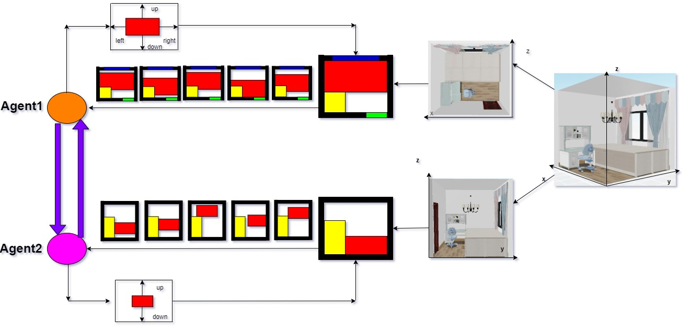
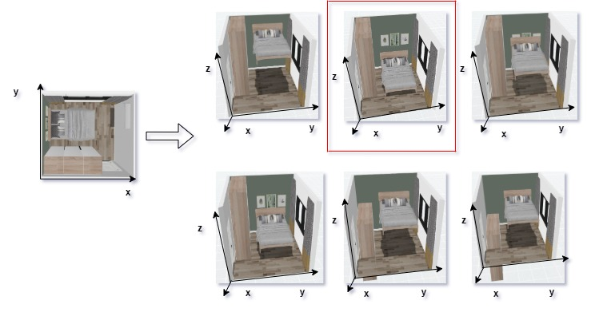
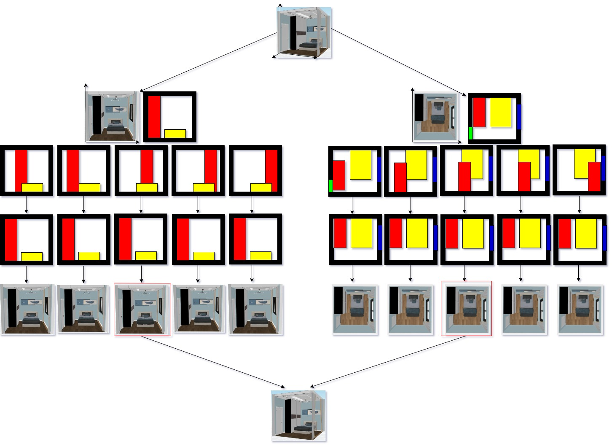

# Multi Agent Reinforcement Learning of 3D Furniture Layout Simulation in Indoor Graphics Scenes

Our paper is at https://arxiv.org/pdf/2102.09137.pdf

## Installation
First install the dependencies via conda:
 * PyTorch >= 1.0.0
 * networkx
 * numpy
 * Python >= 3.6

And then run `pip install .`

#### Multi Agent Reinforcement Learning of 3D Furniture Layout Simulation in Indoor Graphics Scenes

In the industrial interior design process, professional designers plan the furniture layout achieve a satisfactory 3D design for selling. In this paper, we explore the interior graphics scenes design task as a Markov decision process (MDP) in 3D simulation, which is solved by multi agent reinforcement learning. The goal is to produce furniture layout in the 3D simulation of the indoor graphics scenes. In particular, we firstly transform the 3D interior graphic scenes into two 2D simulated scenes. We then design the simulated environment and apply two reinforcement learning agents to learn the optimal 3D layout for the MDP formulation in a cooperative way. We conduct our experiments on a large-scale real-world interior layout dataset that contains industrial designs from professional designers. Our numerical results demonstrate that the proposed model yields higher-quality layouts as compared with the state-of-art model. 

An Example of furniture layout in 2D simulation graphic scenes is not practical for producing a good layout for real 3D graphic scenes. Only one of the six 3D layouts(in red block) is good from the same layout solutions in the 2D simulation.

The Formulation of MDP for the layout of furniture in the 3D indoor scenes. The 3D graphic scenes simulation is firstly transformed into 2 2D simulation scenes. Two simulators are developed and then deep reinforcement learning is applied to train two agents for the exploration of action, reward, state and optimal policy in a cooperative setting.

The 3D graphic scene(first row) is firstly transformed into 2 2D scenes. Then 2 simulators transfer the real indoor scenes into 2 2D simulated graphics indoor scenes(second row). Two agents produce 2D furniture layout(third row) given initially random position(fourth row) in learning each 2D simulation. Then a good 3D layout is produced in the 3D graphic scene.

The Code and More Results will be released soon:)
Please contact deepearthgo@gmail.com if you have questions.

